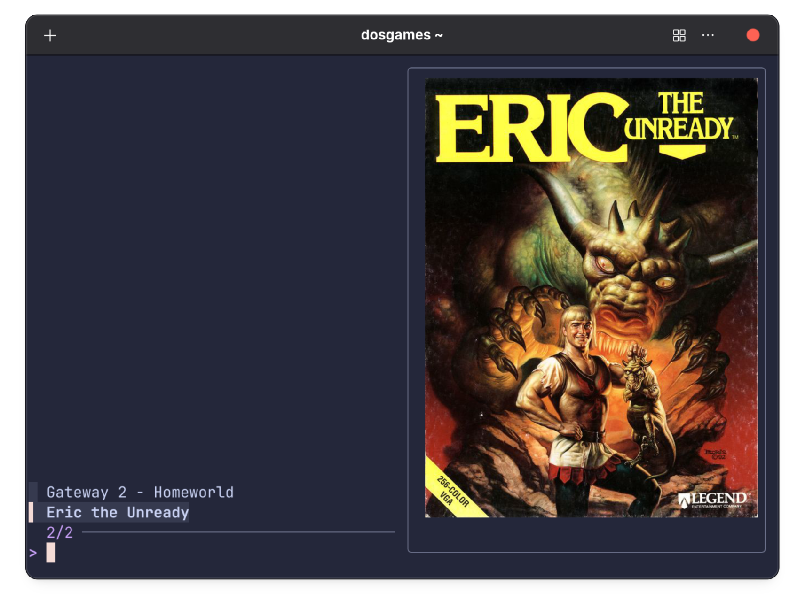

# DOS Game Library

No code here; just the recipe to create the DOS game launcher you see above.

I have two games set up: Eric the Unready, and Gateway 2: Homeworld.

They're all in a directory named dos, whose tree looks like this:

* dos
    * boxart
        * Eric the Unready.jpg
        * Gateway 2 - Homeworld.jpg
    * c
        * ERIC/
        * GATEWAY2/
    * d
        * ERIC.iso
        * GATEWAY2.iso
    * dosbox
        * Eric the Unready.conf
        * Gateway 2 - Homeworld.conf
    * common.conf
    * index.txt

Let's assign the path to that dos directory to an environment variable named DOSROOT.

The c directory is your standard c drive with games installed; the d directory contains CD images.

The common.conf file has settings that I'd want for every game. It contains this:

    [sdl]
    fullscreen = true
    vsync = on

    [fluidsynth]
    soundfont = Reality_GMGS_falcomod.sf2

My DOSBOX conf file for Eric the Unready, to use as our example, looks like this:

    [cpu]
    cpu_cycles = 12000

    [midi]
    mididevice = mt32

    [autoexec]
    @ECHO OFF
    IMGMOUNT D d/ERIC.iso -t cdrom
    MOUNT C c
    C:
    CD ERIC
    ERIC XGA XMOUSE BLASTER 7 220 MT32

Notice that using the game's "exit to DOS" command will actually take you to a DOS prompt. This is how the MiSTer FPGA 0Mhz DOS collection sets things up, and it's intentional here too.

The index.txt file (whose purpose is to implement MRU) is generated by cd'ing to $DOSROOT and running the following:

    find ./dosbox -type f -exec basename {} .conf \;  | sort > index.txt

And then the "dosgames" script will give me the browser in the screenshot.

## Requirements

As you can see, this uses:

* [fzf](https://junegunn.github.io/fzf/)
* DOSBox Staging from FlatHub
* [kitty](https://sw.kovidgoyal.net/kitty/) (for image previews; I actually use Ghostty).
* Soundfont from [Falcosoft](https://falcosoft.hu/softwares.html)

The box art is from mobygames. Everything works in FISH, which is what I use.