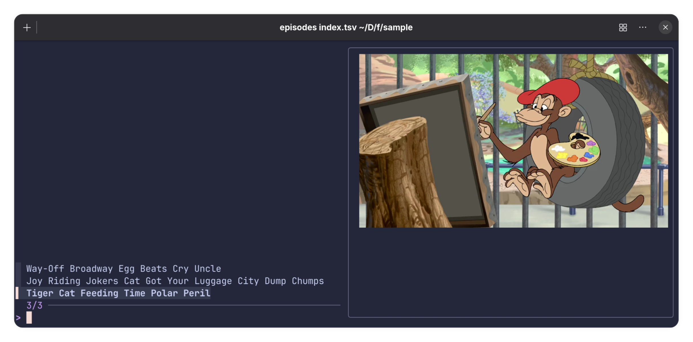

# TV Episodes

I have three Tom and Jerry Tales episodes. Filename are:

* S01E01.mp4
* S01E02.mp4
* S01E03.mp4

Titles and screenshots would be more helpful, but I don't want to rename the files.

I create a tab-separated index.tsv file in the directory:

    ./S01E01.mp4	Tiger Cat Feeding Time Polar Peril
    ./S01E02.mp4	Joy Riding Jokers Cat Got Your Luggage City Dump Chumps
    ./S01E03.mp4	Way-Off Broadway Egg Beats Cry Uncle

I run the "episodes" script on the index file:

    episodes index.tsv

And that gives me:

